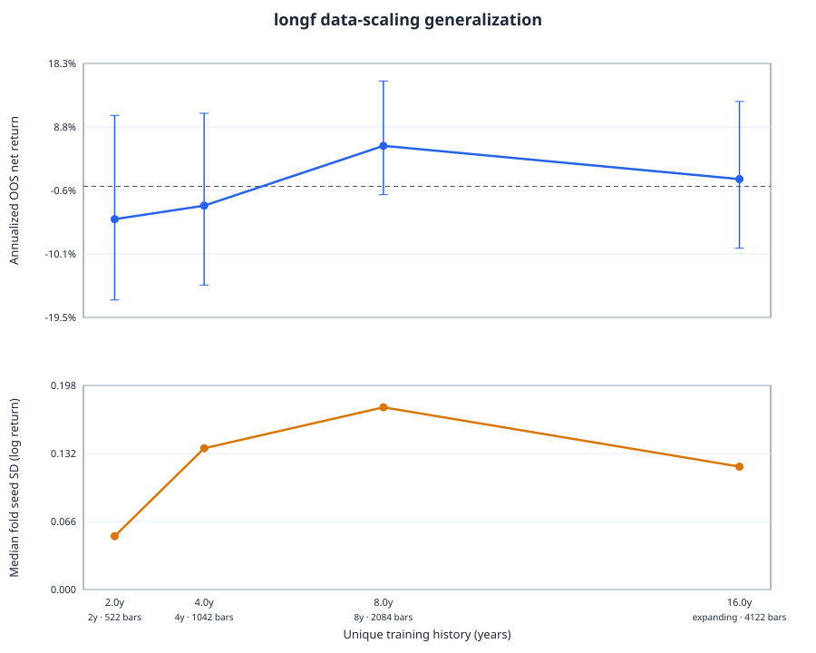

# 07. longf のデータ充足性・スケーリング調査

期間: 2026-08-25 / 対象: GitHub Issue #7

## 事前固定プロトコル

結果を見る前に、一次実験を次のとおり固定した。

- 基準方策: `longf` PPO + MLP。9ペア日足、同一特徴量、`n_steps=1024`、
  `batch_size=1024`、300,000 requested decisions、3シード(42/43/44)
- 評価: 既存walk-forwardの2019〜2025年7フォールド。各フォールドで直前6ヶ月を
  validation、評価年をholdoutとし、評価結果でcheckpoint・条件・seedを選ばない
- 操作変数: train終端を固定し、train開始だけを評価年ごとの2年前・4年前・8年前・
  expanding開始に変更する
- 実行: 全84 runを同じRTX A6000上のCUDAで再学習する。過去のCPU runは混ぜない
- 一次指標: 同一fold・seedで対にした評価年全体のnet cumulative log return
- 二次指標: gross return、annualized Sharpe、max drawdown、cost、gross leverage、
  3-seed action-mean ensemble、およびfold内seed標準偏差
- 独立情報量: raw timestamp、feature warmup後timestamp、到達可能な固有market
  transition、128-step episode開始候補、実行env decisions、実測完了episode、再利用率を
  別々に報告する。9ペア同時観測を独立な9標本とは数えない
- ESS: pair別のdaily log return、absolute/squared return、mom24、xr_mom24に対し、
  最大lag 252のGeyer initial-positive-pair推定を使う。負の相関で `ESS>N` となる場合は
  `N` を上限とする。横断依存はreturn相関行列のparticipation ratioを別途示す
- 不確実性: 7個の評価年を再標本化するfold bootstrapと、隣接2年を単位とするmoving-block
  bootstrapを併記する。日次barをIIDとして信頼区間を作らない

PPOの `total_timesteps` は下限である。8 env × 1,024 steps単位のため、各runは37 rollout、
303,104 env decisions、既定10 epochで2,960 optimizer minibatch updates、3,031,040 sample
presentationsとなる。128-step episodeが完走する場合の換算は2,368本だが、最終表では
マージンコールを含む実測完了数を使う。

### データ品質とlineage

元のgitignored cacheが環境になかったため、`configs/fetch_1d9p_2003.yaml` からyfinanceを
再取得し、FRED金利を60日lagで付与した。再取得値には桁違いのOHLCと翌日全戻し型の
不良printが残っていたため、`forex-clean-spikes` の一般ルールで修復する。修復件数を14行に
固定し、providerの改訂で件数が変わった場合は実験を停止する。実験成果物にはraw/clean/carry
cacheのSHA-256を記録する。実際のinner-join後の期間は2005-07-19〜2025-12-31である。

- raw: `8055ab6d0f40a9602544f17fb52683344245600396d364b2afa0211e2082b375`
- clean: `2d2c032d23de7caae77807455d1db4f6d334f3b591ceeb85b41295461454ad8e`
- carry: `723db7c935dcc27c147007728358d098243eae96998eae146db4c7df02bd081e`

## スコープ境界

ペア数を変えると現MLPの入力次元・action次元・parameter数・`xz/xr`特徴量の意味まで変わり、
cross-sectional breadthと方策容量を分離できない。これはarchitecture searchを禁止する
IssueのNon-goalと衝突するため、一次因果実験には含めず、既存の7/9/10ペア結果を探索的証拠
としてのみ扱う。

同様に既存時間足実験はユニバース、特徴量、観測窓、decision intervalが異なるため、日足との
controlled comparisonではない。高頻度化に関する結論は既存結果の限定的な再解釈とし、
新しいfrequency experimentは別Issueの対象とする。

## 結果

固定済みcommit `2d11aca` をRTX A6000上で実行し、84/84 source runと28/28 ens3を
失敗なしで完了した。全source runのmetadataは `device: cuda` と同commitを記録している。
各runは303,104 steps、2,368完了episode、20 validation walkだった。評価値を見て
checkpoint・seed・条件を選び直していない。

### 一次スケーリング結果

点推定は3 seed × 7評価年を連結した年率net return、CIは各評価年内でseed平均してから
7 foldを再標本化したもの。`ens3` は3方策のaction平均であり、一次指標とは分けて示す。

| 履歴 | 中央bars | 年数 | net/年 | fold 95% CI | 2-fold block 95% CI | fold内seed SD中央値 | ens3 net/年 |
|---|---:|---:|---:|---:|---:|---:|---:|
| 2年 | 522 | 2.0 | −4.89% | [−16.91%, +10.56%] | [−18.21%, +10.64%] | 0.052 | −3.65% |
| 4年 | 1,042 | 4.0 | −2.87% | [−14.69%, +10.88%] | [−15.74%, +9.04%] | 0.137 | −0.33% |
| 8年 | 2,084 | 8.0 | +6.04% | [−1.24%, +15.69%] | [−1.69%, +14.50%] | 0.177 | +7.94% |
| expanding | 4,122 | 16.0 | +1.08% | [−9.22%, +12.65%] | [−9.79%, +13.21%] | 0.119 | +3.62% |

曲線は2→4→8年では改善するが、expandingで低下するため単調ではない。隣接条件のfold平均
差は2→4年が+0.016 log-return [−0.040, +0.079]、4→8年が+0.066
[−0.007, +0.130]、8年→expandingが−0.036 [−0.081, +0.010]。4→8年だけは
2-fold block CIが[+0.008, +0.129]だったが、通常のfold CIは0を跨ぐ。7評価年しかないため、
8年を「最適」と選んで再利用するのではなく、有限履歴でピークが観測されたという記述的証拠
に留める。

二次指標でも同じ形で、ens3のnet/grossは2年 −3.65/−1.28%、4年 −0.33/+2.09%、
8年 +7.94/+10.29%、expanding +3.62/+5.53%。8年ens3は5/7年プラス、平均Sharpe 0.50、
平均max drawdown 11.8%だった。expandingは4/7年、Sharpe 0.07、drawdown 9.4%である。
追加履歴によるseed安定化は見えず、fold内seed SD中央値は0.052→0.137→0.177→0.119と
推移した。

### 固有履歴とデータ再利用

次表は17個の既存walk-forward foldについて、expanding条件の学習側だけを監査したもの。
`usable` はfeature warmup 32と観測窓32を除いた到達可能transition、`starts` は128-step
episodeの固有開始候補、`reuse` は実行env decisions / usableである。optimizer更新は全fold
2,960 minibatch、sample presentationsは3,031,040/runで一定であり、bars増加を学習step増加
で代用していない。

| 評価年 | bars | 年数 | pairs | usable | starts | env steps | 完了episodes | reuse |
|---:|---:|---:|---:|---:|---:|---:|---:|---:|
| 2009 | 760 | 2.9 | 9 | 696 | 569 | 303,104 | 2,368 | 435.5x |
| 2010 | 998 | 4.0 | 9 | 934 | 807 | 303,104 | 2,368 | 324.5x |
| 2011 | 1,259 | 5.0 | 9 | 1,195 | 1,068 | 303,104 | 2,368 | 253.6x |
| 2012 | 1,519 | 5.9 | 9 | 1,455 | 1,328 | 303,104 | 2,368 | 208.3x |
| 2013 | 1,779 | 6.9 | 9 | 1,715 | 1,588 | 303,104 | 2,368 | 176.7x |
| 2014 | 2,038 | 8.0 | 9 | 1,974 | 1,847 | 303,104 | 2,368 | 153.5x |
| 2015 | 2,298 | 9.0 | 9 | 2,234 | 2,107 | 303,104 | 2,368 | 135.7x |
| 2016 | 2,559 | 9.9 | 9 | 2,495 | 2,368 | 303,104 | 2,368 | 121.5x |
| 2017 | 2,821 | 11.0 | 9 | 2,757 | 2,630 | 303,104 | 2,368 | 109.9x |
| 2018 | 3,081 | 11.9 | 9 | 3,017 | 2,890 | 303,104 | 2,368 | 100.5x |
| 2019 | 3,339 | 12.9 | 9 | 3,275 | 3,148 | 303,104 | 2,368 | 92.6x |
| 2020 | 3,599 | 13.9 | 9 | 3,535 | 3,408 | 303,104 | 2,368 | 85.7x |
| 2021 | 3,861 | 15.0 | 9 | 3,797 | 3,670 | 303,104 | 2,368 | 79.8x |
| 2022 | 4,122 | 16.0 | 9 | 4,058 | 3,931 | 303,104 | 2,368 | 74.7x |
| 2023 | 4,383 | 17.0 | 9 | 4,319 | 4,192 | 303,104 | 2,368 | 70.2x |
| 2024 | 4,643 | 17.9 | 9 | 4,579 | 4,452 | 303,104 | 2,368 | 66.2x |
| 2025 | 4,904 | 19.0 | 9 | 4,840 | 4,713 | 303,104 | 2,368 | 62.6x |

一次スケーリングfoldの中央値では、env-decision再利用率は2/4/8/expanding年で
661.8x/309.9x/150.1x/74.7x。10 optimizer epochまで数えると、固有transition当たりの
sample presentationはその10倍である。episode開始候補に対する2,368 episodeの比は
7.15x/2.78x/1.25x/0.60xだが、開始点は復元抽出なので全候補を一度ずつ見ることを意味しない。

### 自己相関と横断依存を調整した情報量

Geyer ESSはpair別系列の中央値。return ESSがほぼNなのは日次符号付きreturnの負または弱い
自己相関によるもので、IIDの保証ではない。absolute/squared returnと24日signalではvolatility
clustering・窓重複により大幅に小さくなる。9ペアの同時barも独立9標本とは数えず、return
相関行列のparticipation-ratio rankを別表示した。

| 評価年 | bars | return ESS | abs ESS | squared ESS | mom24 ESS | xr_mom24 ESS | carry更新日 | 有効pair rank |
|---:|---:|---:|---:|---:|---:|---:|---:|---:|
| 2009 | 760 | 759 | 39 | 103 | 41 | 40 | 44 | 1.8 |
| 2019 | 3,339 | 3,338 | 78 | 126 | 105 | 165 | 178 | 1.7 |
| 2025 | 4,904 | 4,903 | 106 | 181 | 169 | 242 | 260 | 1.8 |

2025 foldでも、価格returnは約4.9kある一方、volatility proxyのESSは106〜181、重複する
mom24/xr_mom24は169/242、9ペアの有効rankは1.8に過ぎない。したがって303k stepsや
9×4.9kセルを独立情報量と解釈するのは不適切である。

### Issueの問いへの回答

1. **単調改善か飽和か:** 単調ではない。8年まで改善し、約16年のexpandingでは悪化した。
   古いregimeを加える利益より分布ずれ・有限容量の負担が勝つ可能性と整合するが、CIは広い。
2. **seed分散は下がるか:** 下がらない。追加履歴だけではoptimizer/方策の不安定性を解消しない。
3. **横断breadthは時間depthより有益か:** controlledには判定不能。ペア追加は入力・action・
   parameter数とcross-sectional特徴量を同時に変える。既存の探索結果では10ペア化は疎な
   top2ルールを改善した一方、generic RLは悪化しており、「方策次第」が現時点の結論である。
4. **高頻度化は有益か:** 現行タスクでは肯定できない。既存9ペア時間足実験は密度24倍でも
   ens3 net −1.9%、gross +1.1%で、日中ノイズと相関sampleを増やした。ただし日足との完全な
   controlled comparisonではない。
5. **低容量の構造化方策には十分か:** plausibly yes。既存の疎なcross-sectional ruleは安定した
   正のceilingを持つ一方、今回の約655k parameter PPO+MLPは履歴増加で単調改善もseed安定化も
   得られなかった。データ不足だけでなく、方策クラスと観測・行動の構造不一致が支配的である。

## 推奨

Issue指定の選択肢では **「方策複雑度を下げる / formulationを変える」** を推奨する。
より古い履歴の取得、単純な高頻度化、無条件なペア追加を次の主施策にはしない。具体的には、
疎なcross-sectional選択・低leverage・risk controlを方策に構造として持たせ、独立した新しい
holdoutで検証する。今回の評価年を使って8年窓を新たなwinnerとして選ぶことはしない。

機械可読な全値は [data_audit.csv](results/issue7/data_audit.csv)、
[scaling_results.csv](results/issue7/scaling_results.csv)、[report.json](results/issue7/report.json)、
生成表は [report.md](results/issue7/report.md) に保存した。
